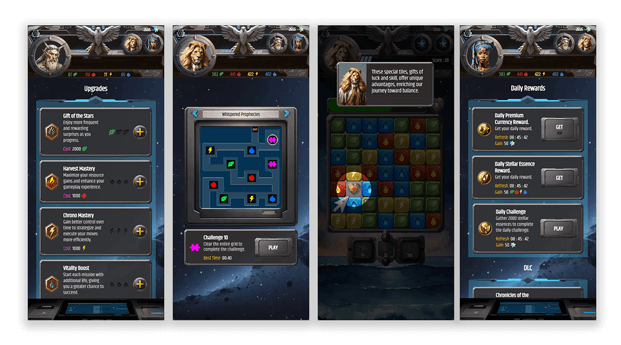

# Stellar Fusion

## Overview

Stellar Fusion is a captivating puzzle game developed using Phaser for mobile and web by B2TGame. It combines the strategic elements of the classic Same Game with fast-paced action. The entire game structure and all gameplay mechanics were meticulously implemented by me, ensuring a cohesive and polished gaming experience from start to finish.

[Play](https://play.charade.ai/game/stellar-fusion/play)

## Features

- **Two Game Modes**: Switch between the fast-paced Action Mode and the strategic Puzzle Mode. - **Action Mode**
  In Action Mode, the gameplay is similar to a classic Match-3 game but with a twist. Players must click on matching tiles as fast as possible within a limited amount of time. Speed and accuracy are key to achieving high scores and earning soft currency. - **Puzzle Mode**
  Puzzle Mode is a more strategic experience, akin to the original SameGame. Players must carefully plan their moves to destroy tiles without getting stuck. The goal is to clear as many tiles as possible while considering future moves to avoid blocking themselves.

- **Power-Ups**:
  Power-ups provide players with tools to help them achieve their goals in the game. The available power-ups vary depending on the selected game mode:

  - **Action Mode Power-Ups**: _Stellar Explosion_ that explode every tile of a certain type, _Bomb_ that expode several tiles in a certain radius, _Hourglass_ that reduce the multiplicator gauge speed.

  - **Puzzle Mode Power-Ups**: _Teleport_ a tile in an empty space, _Swap_ two tiles, _Undo_ the previous move.

- **Upgrades**: Use soft currency earned during gameplay to purchase upgrades, enhancing your abilities and increasing your chances of success.

- **Storyline and Dialogs**:
  Immerse yourself in a series of missions guided by intriguing protagonists who assist you throughout the game. Each mission unfolds with engaging dialogue that drives the storyline forward, providing context and motivation for your actions.

- **Engaging Gameplay**: Stellar Fusion combines speed, strategy, and skill, providing a challenging and rewarding experience for players of all levels.

## Media

